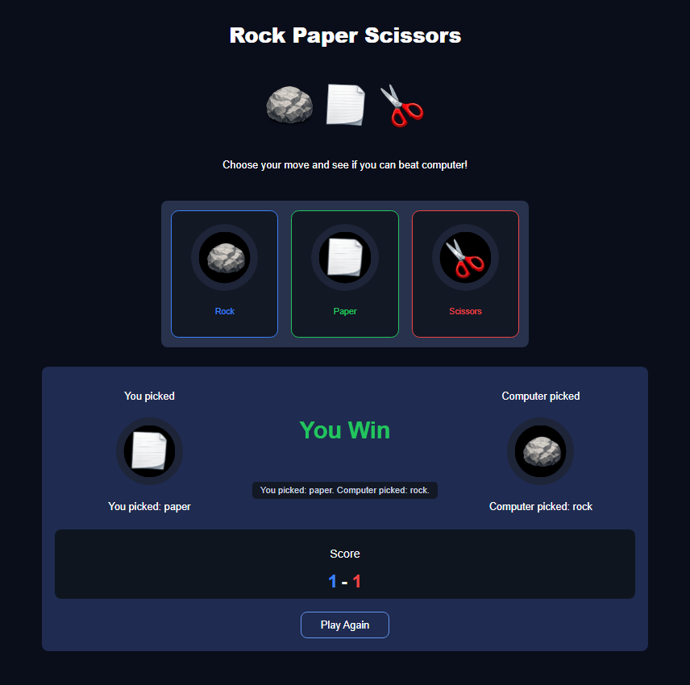

# 🎮 Rock Paper Scissors Game

A modern implementation of the classic Rock Paper Scissors game built with **HTML**, **CSS**, and **Vanilla JavaScript**.

## 🚀 Live Demo

👉 https://jpparralopes.github.io/rock-paper-scissors-game/

## ✨ Features

- Interactive interface
- Random computer moves
- Dynamic DOM manipulation
- Live scoreboard
- Best-of-three match
- Game over state
- Play Again functionality

## 🛠️ Technologies

- HTML5
- CSS3
- JavaScript (ES6)

## 📚 What I practiced

- DOM manipulation
- Event handling
- Conditional logic
- Functions
- State management
- UI updates
- Code organization
